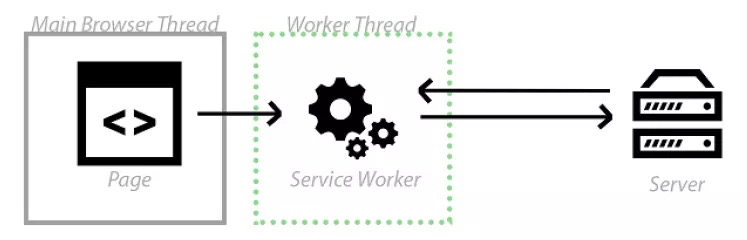
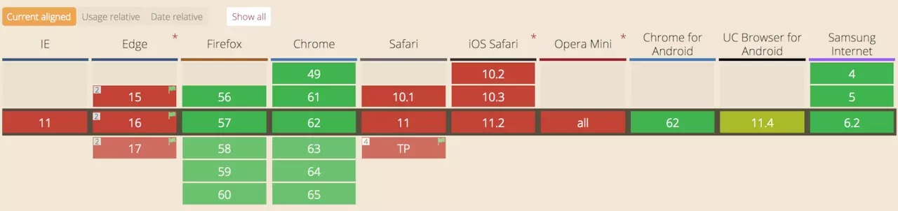
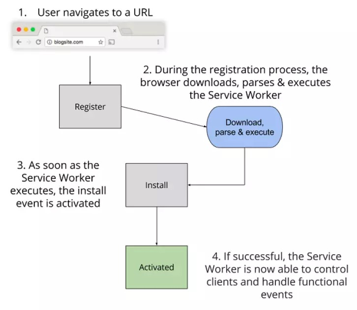
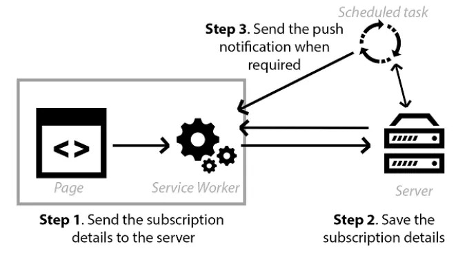

# A simple PWA project just for learning

> 具体细节可以移步我的一篇

## Start

npm i

npm start

## What is service worker?

简单的说就是浏览器发送请求前的一个管家，但不一定每个浏览器都会有。

例如ie就全军覆没，还有safary也是在11.4后才支持

## How does service worker works?

首先，浏览器需要先注册service worker后才能使用它的功能。

之后每次获取服务器的资源前都会经过这一层，这时候可以决定是否要使用缓存。

获取到资源后也可以选择是否把资源缓存起来以便将来使用。

